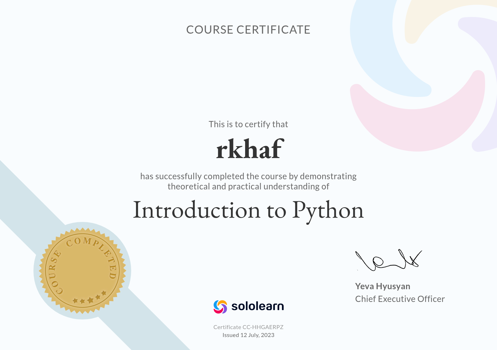
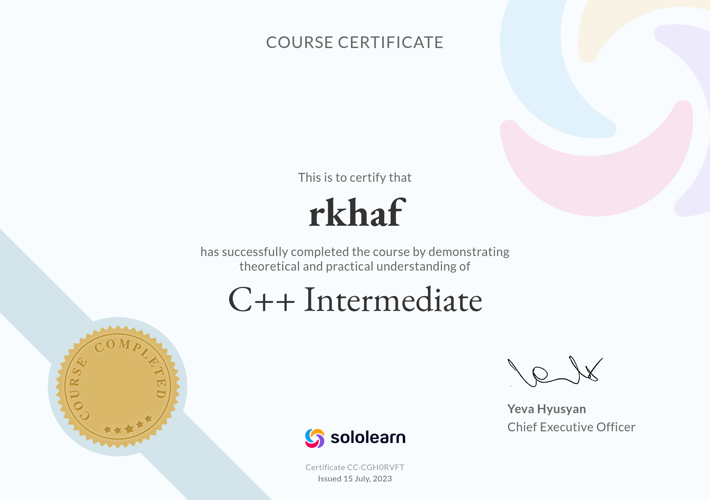
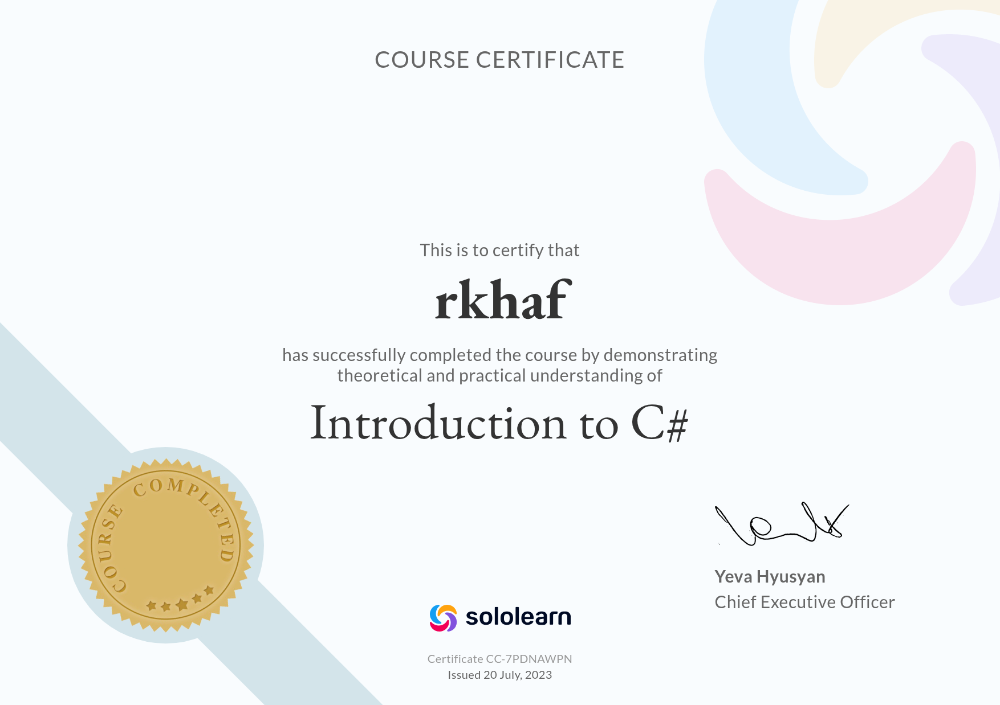

# 👋 Halo gusy, Nama sy Muhammad Rakha Fadhilah

Sya adalah mahasiswa aktif Politeknik Negeri Indramayu dgn prodi Rekayasa Perangkat Lunak 
ak berultah pada 18 mei (incase mau ngucapin hbd🥀) 
udh segini aja infornya takut kena doksing🙏🙏.

---

## 🧑🏿‍🦲 Tentang Sy
- 🖼️ Generalis 3d (wlwpun masi nub).
- 🎮 Suka pengembangan game (tpi gasuka desain).
- 🌐 Ngulik webdev kadang kadang.

---

## 📜 Sertifikat
Kumpulan sertifikat diluar kuliah:

| Bahasa | Gambar |
| :--- | :---: |
| 🐍 Piton |  |
| ⚙️ CPP | 
 
 |
| ⚙️ Csharp |  |
| 🌐 Csharp |  |

---

## 🛠️ Tech Stack & Tools
- 🗣️ **Bahasa's:** C++ (masi pemula), Python (masi belajar), HTML (agak males), SQL (kata ibu dosenmah skil ak udh cukup)
- 🔪 **Frameworks/Libs:** SFML
- 🧰 **Tools:** GitHub, VS Code, Godot Engine, Unreal, Blender

---

## 📊 GitHub Stats

